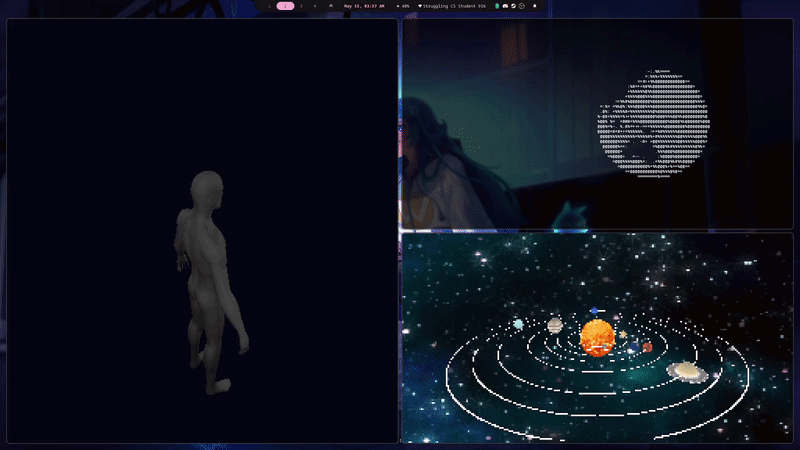

# termgl
A Rust crate for terminal software rasterizer


## Features
- **Output modes:** Supports ASCII and 24-color outputs
- **Shading modes:** Supports Phong and Gouraud shading
- **UV Mapping:** Supports texture mapping for color, parallaxed height, and normal mapping
- **Mesh primitives:** Have pre-made UV sphere and flat ring creation functions
- **Background options:** Supports solid color, gradient, and pictured background
- **OBJ import:** Supports OBJ importing with MTL files
- **Mesh simplification:** A mesh simplification algorithm is provided (vertex clustering, Rossignac-Borrel)
- **Terminal resize auto-handling**

## Usage

Add to Cargo.toml:

```toml
[dependencies]
termgl = "0.1.0"
```

Basic pipeline:

```rust
use termgl::graphics::{Background, Camera, Pipeline3D, PrinterType, ShadingMode};
use glam::Vec3;
use std::f32::consts::PI;
 
let camera = Camera::new(Vec3::Y, -Vec3::Z, Vec3::new(0.0, 0.0, 30.0), PI / 4.0);
let background = Background::SolidColor(Vec3::ZERO);
let mut pipeline = Pipeline3D::new(background, PrinterType::Color, camera, ShadingMode::Phong);

let light_source = PointLightSource::new(/* Light source parameters */);
pipeline.shader.add_point_light_source(light_source);
 
loop {
    pipeline.start_frame();
    pipeline.render_mesh(&mut mesh);
    pipeline.end_frame();
}
```

## Examples
 
### Solar System
 
An animated solar system with textured planets, Saturn's rings, orbit lines, and a star-field background.
 
```
cargo run --release --example solar-system
```
 
Assets expected under `examples/assets/`: `mercury.jpg`, `venus.jpg`, `earth.jpg`, `mars.jpg`, `jupiter.jpg`, `saturn.jpg`, `saturn_ring.jpg`, `uranus.jpg`, `neptune.jpg`, `sun.jpg`, `star-background.jpg`.

### Show Meshes

A rotating static mesh

```
cargo run --release --example show_mesh -- <mesh name> <simplified|original>
```

Where `<mesh name>.obj` must lie under `examples/assets`, and `<mesh name>` can be: `car`, `male`, `canon`, `vader`
One can contrast the unsimplified vs simplified meshes via the second option.

### Rotating earth, ASCII mode

A rotating earth, rendered via ASCII mode

```
cargo run --release --example earthscii
```

Assets expected under `examples/assets`: `earth_bw.jpg`

## Crate Structure
 
```
src/
├── lib.rs
├── graphics/
│   ├── pipeline3d.rs     # High-level render loop
│   ├── camera.rs         # View + perspective projection
│   ├── mesh.rs           # VAO/EBO, sphere/ring generation, OBJ I/O
│   ├── rasterizer.rs     # Triangle rasterization, depth buffer
│   ├── shader.rs         # Accumulates light sources
│   ├── point_light_source.rs
│   ├── vertex.rs         # Vertex, RasterVertex, barycentric interpolation
│   ├── uv_map.rs         # Texture, normal, and height maps
│   ├── printer.rs        # Terminal output (color / ASCII)
│   └── options.rs        # ShadingMode enum
└── simplifier/
    └── vertex_cluster.rs # Rossignac–Borrel mesh simplification
```
 
## Dependencies
 
- [`glam`](https://crates.io/crates/glam) — math (Vec2/3/4, Mat3/4)
- [`image`](https://crates.io/crates/image) — texture loading
- [`crossterm`](https://crates.io/crates/crossterm) — terminal size and cursor control
- [`rand`](https://crates.io/crates/rand) — random initial planet positions

